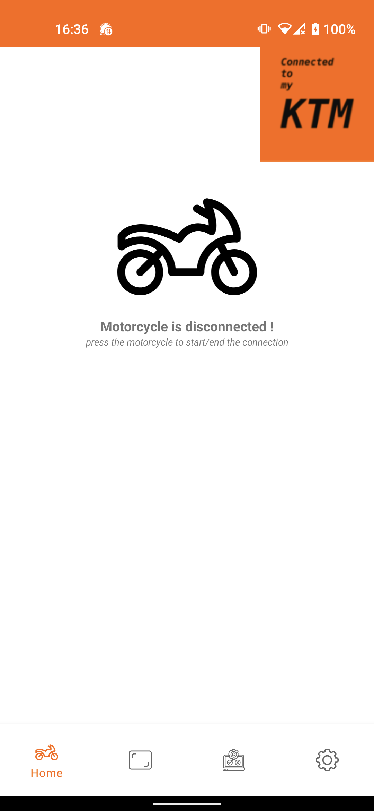
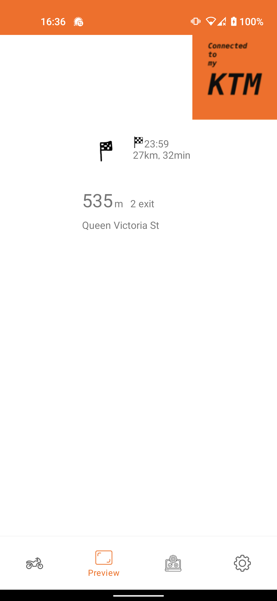
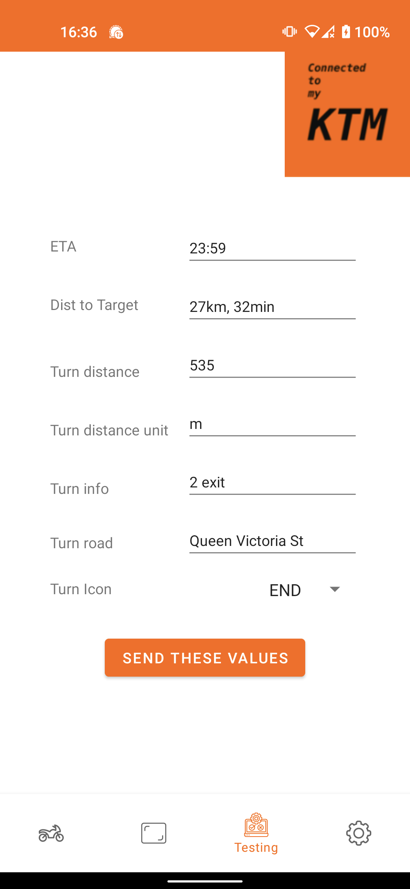
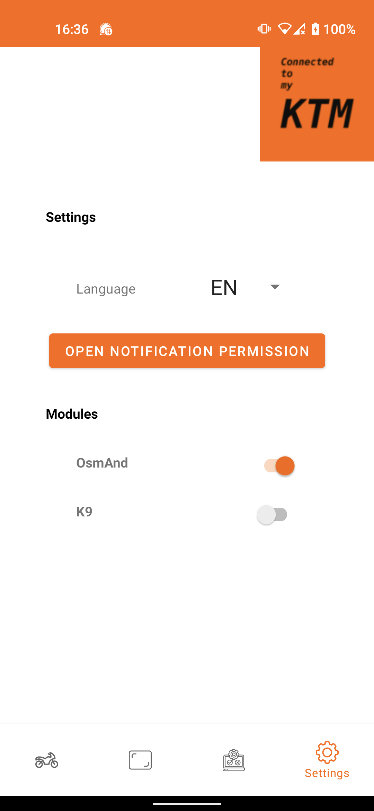

# Connected to my ktm

This project was developed in order to use the GPS option available on KTM motorcycles without having to use the official application that does not allow us to use another GPS application.

This project is completely open-source and does not contain any [**Anti-Features**](https://f-droid.org/docs/Anti-Features/)

## Motorcycle compatible
| Model | Year | compatible |
| --- | --- | --- |
| Ktm 790 adventure R | 2019 | ✅ |
| Ktm 1290 Super Duke R | 2021 | ⚠️ untested — same Bosch LC8 dashboard family, *probably* works; see [protocol notes](docs/KTM-MY-RIDE-PROTOCOL.md) |

> **KTM MY RIDE must be activated on the bike.** On many models (incl. the 1290 Super Duke R)
> it is an optional feature needing the connectivity control unit and a dealer/menu unlock
> before Bluetooth pairing is available. See the [protocol notes](docs/KTM-MY-RIDE-PROTOCOL.md).

> **Android only.** iOS cannot talk to the dashboard's serial channel without Apple MFi
> certification, so a custom iOS/MAUI app cannot connect — see the [protocol notes](docs/KTM-MY-RIDE-PROTOCOL.md#0-tldr--the-two-decisions-that-shape-the-whole-project).

## Application compatible
| Application | Version | compatible |
| --- | --- | --- |
| OsmAnd | 3.6.3 | ✅ |
| OsmAnd+ | 3.9.10 | ✅ |

## Screenshots

## Contribution Guide
If you have discovered a bug or need a new feature, feel free to create an issue directly on Github.

You can also contribute with a pull-request.

### Modules
If you want to add compatibility with another GPS application or other, you just have to implement the Module interface and add your module in the `HashMap` of `notification/NotificationListener.java`.

Concerning Google Maps, since I have a phone without google services I will not develop this module. However, if you want to create this module do not hesitate. Otherwise, there is this [application](https://play.google.com/store/apps/details?id=com.undingen.maps4ktm&hl=en_US&gl=US) may interest you.

## Permission

| Permission key | Usage |
|---|--- |
| `android.permission.BLUETOOTH`| Used to communicate with the motorcycle. |
| `android.permission.BIND_NOTIFICATION_LISTENER_SERVICE` | Used to read notifications in order to send them to the motorcycle |

## Credit
This project is inspired by this [application](https://play.google.com/store/apps/details?id=com.undingen.maps4ktm&hl=en_US&gl=US). More information about bluetooth communication [here](https://advrider.com/f/threads/ktm-my-ride-enhancements-needed.1435929/page-2).

## Conctact me
dev@guillaumepin.ch
## .NET MAUI / iOS port — diagnostic test app (connection unproven)
The `KTMConnectedMaui` folder is an iOS test app. iOS only reaches Classic-Bluetooth serial
devices through Apple's ExternalAccessory/MFi framework; Core Bluetooth (BLE) cannot see the
RFCOMM/SPP channel at all. App Store distribution would require MFi whitelisting, but a
**sideloaded dev build** may open a session *if* the dash advertises an iAP protocol string
declared in `Info.plist` — and KTM's real string is unknown. The app therefore doubles as a
probe: "Toon accessoires & protocollen" dumps every MFi accessory iOS sees with its protocol
strings. If the dash shows up, add its strings to `Info.plist`, rebuild, connect, and use the
"Simuleer navigatie" / "Simuleer flitspaal" buttons to test rendering on the dash. If the
dash never appears there, the iOS route is definitively closed — use the Android app.
Full reasoning in the [protocol notes](docs/KTM-MY-RIDE-PROTOCOL.md#0-tldr--the-two-decisions-that-shape-the-whole-project).

